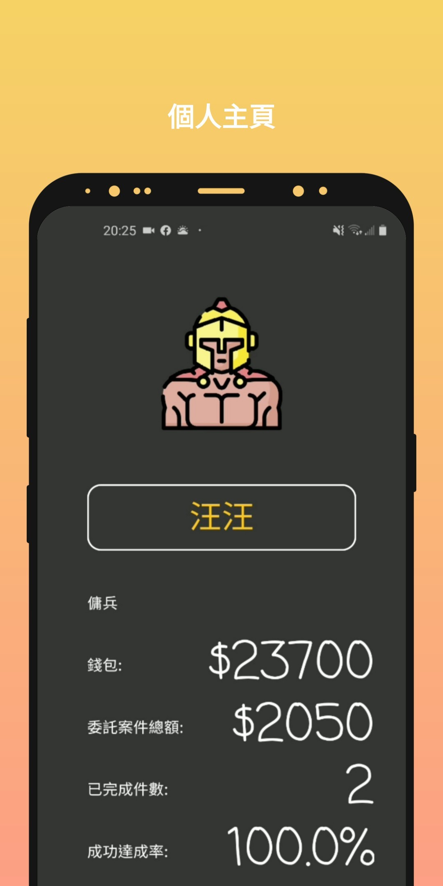
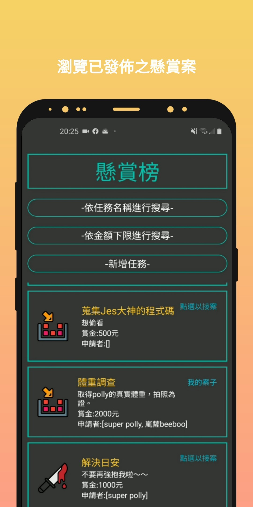
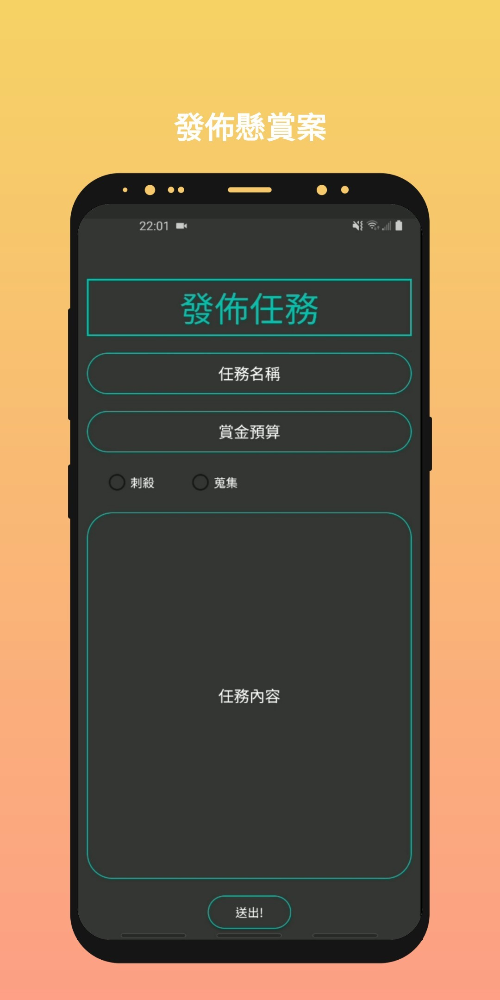

# Sparta
由於故事背景設定，我們團隊要為好戰聞名的古希臘城邦「 斯巴達 」打造一個媒合雇主與傭兵，能夠接/發案的線上平台。使用者能以雇主或傭兵兩種身分進行註冊。雇主能夠發起懸賞案，設定任務目標、賞金。傭兵則能夠瀏覽並應徵感興趣的案子。送出申請後，雇主可以依據每位申請者的歷史紀錄、個人評分、希望賞金的多寡去選擇欲雇用之傭兵。傭兵完成任務後，可以拍照上傳交由雇主審核，雇主判定任務成功與否。若成功即發放賞金，失敗則無賞金。這樣就完成了一次開案->接案->結案的流程。

